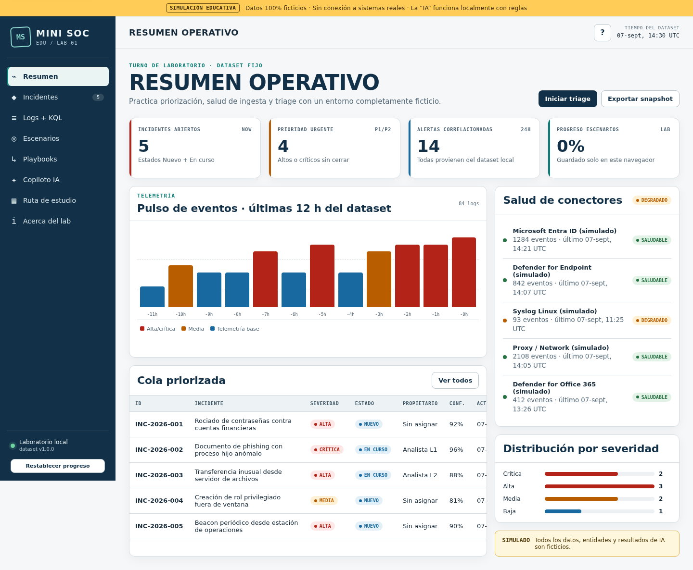

# Mini SOC Educativo con IA

Laboratorio web **100% local, sin dependencias y sin conexión a servicios reales** para practicar el flujo de trabajo de un analista SOC L1: priorización, triage, revisión de salud de telemetría, consultas tipo KQL, documentación, playbooks y escenarios de incidente.

> **SIMULACIÓN EDUCATIVA — DATOS 100% FICTICIOS.** No es una herramienta de seguridad, no detecta amenazas reales y no se conecta con Microsoft Sentinel, Defender XDR, Entra ID, OpenAI ni ningún otro servicio. El “copiloto IA” es una simulación determinística basada en reglas JavaScript.

## Vista funcional



- Resumen operativo con KPIs derivados del dataset.
- Cola de 8 incidentes y 14 alertas correlacionadas.
- 84 logs ficticios consistentes entre identidad, endpoint, correo, auditoría y red.
- Detalle de incidente con entidades, línea de tiempo, hipótesis y acciones.
- Laboratorio de un subconjunto educativo de KQL.
- 6 escenarios guiados con checklist y puntuación local.
- 5 playbooks imprimibles.
- Copiloto local simulado, sin llamadas de red.
- Ruta de estudio SOC L1 con progreso guardado en `localStorage`.
- Exportación JSON/CSV con disclaimer de simulación.
- Diseño responsive, navegación por teclado y soporte para movimiento reducido.

## Inicio rápido

### Opción 1 — abrir directamente

Abre `index.html` en un navegador moderno. La aplicación funciona desde `file://` y no requiere build.

### Opción 2 — servidor local

```bash
python3 -m http.server 8080
# visita http://localhost:8080
```

Con npm, el mismo comando está disponible como:

```bash
npm start
```

## Validar el proyecto

No hay dependencias que instalar.

```bash
npm test
```

La validación comprueba:

- referencias incidente → alerta/log/entidad/escenario;
- correspondencia alerta → incidente;
- uso de dominios `.example` y rangos IP reservados o privados;
- IDs únicos;
- presencia del disclaimer y archivos esenciales;
- regeneración determinística de los datos.

Para regenerar `src/data.js` con la misma semilla:

```bash
npm run generate:data
```

## Publicar en GitHub

```bash
git init
git add .
git commit -m "feat: add Mini SOC educativo con IA"
git branch -M main
git remote add origin https://github.com/TU-USUARIO/mini-soc-educativo-ia.git
git push -u origin main
```

Para GitHub Pages: **Settings → Pages → Deploy from a branch → `main` / root**. No se requiere workflow ni proceso de compilación.

## Arquitectura

```text
mini-soc-educativo-ia/
├── index.html                 # shell accesible y carga de scripts clásicos
├── src/
│   ├── styles.css             # sistema visual responsive
│   ├── data.js                # dataset simulado, usable en navegador y Node
│   └── app.js                 # router, vistas, estado y motor KQL/IA simulados
├── tools/generate-data.py     # generador determinístico
├── tests/validate-data.js     # pruebas de consistencia y seguridad del dataset
├── docs/                      # arquitectura, guía, datos, escenarios y transparencia IA
├── assets/favicon.svg
└── .github/                   # plantillas para issues y pull requests
```

Se usan scripts clásicos, no módulos, para conservar compatibilidad al abrir desde disco. No hay CDN, fuentes remotas, trackers, cookies ni analítica.

## Alineación educativa

El contenido implementa los ejes del manual base:

1. revisar incidentes nuevos por severidad y estado;
2. validar usuario, IP, tiempo y patrón;
3. comprobar salud de conectores e ingesta;
4. practicar KQL básico sobre SigninLogs y Syslog;
5. distinguir hechos, hipótesis y falsos positivos;
6. documentar evidencia, contención y escalamiento;
7. fortalecer redes, identidad, PowerShell/KQL y tecnologías Microsoft Security;
8. seguir una rutina de estudio de una hora con práctica opcional.

## Datos seguros por diseño

- Personas y organización inventadas (`Contoso Lab`).
- Correos bajo `contoso-lab.example`.
- IPs de documentación `192.0.2.0/24`, `198.51.100.0/24`, `203.0.113.0/24` o rangos privados.
- Sin credenciales, tokens, malware, payloads funcionales ni IOCs reales.
- Comandos potencialmente peligrosos aparecen solo como texto inerte dentro del dataset.
- Todas las exportaciones identifican el contenido como simulado.

## Limitaciones intencionales

- El editor KQL implementa solo filtros y agregaciones didácticas; no es el motor Kusto.
- El copiloto no es un LLM y no interpreta lenguaje de forma general.
- El estado modificado no altera `src/data.js`; se guarda solo en `localStorage`.
- Las acciones de aislamiento, bloqueo, revocación y escalamiento son narrativas.

## Documentación

- [Guía de usuario](docs/USER_GUIDE.md)
- [Arquitectura](docs/ARCHITECTURE.md)
- [Modelo de datos](docs/DATA_MODEL.md)
- [Escenarios](docs/SCENARIOS.md)
- [Transparencia de IA](docs/AI_TRANSPARENCY.md)
- [Contribuir](CONTRIBUTING.md)
- [Seguridad](SECURITY.md)

## Licencia

MIT. Consulta [LICENSE](LICENSE).
